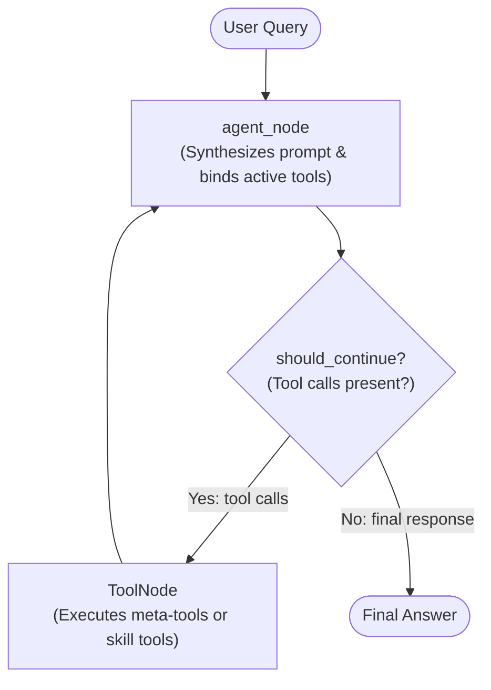

# 🧠 LangGraph Skills

[](https://www.python.org/downloads/)
[](https://github.com/langchain-ai/langgraph)
[](https://opensource.org/licenses/MIT)
[](https://github.com/astral-sh/ruff)

A modular, self-contained architecture showcasing how to implement **Agent Skills** and **Progressive Disclosure** in **LangGraph**.

---

## 📖 Table of Contents

- [The Problem: Context Bloat & The 40-Tool Limit](#-the-problem-context-bloat--the-40-tool-limit)
- [The Solution: Progressive Disclosure](#-the-solution-progressive-disclosure)
- [Architecture & Graph Design](#-architecture--graph-design)
- [Included Reference Skills](#-included-reference-skills)
- [Repository Layout](#-repository-layout)
- [Quick Start](#-quick-start)
- [Usage Guide](#-usage-guide)
  - [Command-Line Interface (CLI)](#command-line-interface-cli)
  - [Programmatic API](#programmatic-api)
- [How to Build a New Skill](#-how-to-build-a-new-skill)
- [Testing & Quality Assurance](#-testing--quality-assurance)
- [License](#-license)

---

## 🛑 The Problem: Context Bloat & The 40-Tool Limit

Monolithic agents typically bind dozens of tools and hundreds of lines of instructions upfront into a single system prompt. This introduces critical failure modes:

1. **Context Bloat & Cost**: Every single conversation turn forces the LLM to process thousands of tokens for tools and instructions that are completely irrelevant to the prompt.
2. **Tool Selection Degradation**: As tool definitions grow beyond 10–15 functions, LLMs experience attention dilution and begin hallucinating arguments or picking incorrect tools.
3. **Instruction Bleed**: Unrelated SOPs conflict in the prompt, resulting in degraded reasoning ("Lost in the Middle").

---

## 💡 The Solution: Progressive Disclosure

**LangGraph Skills** uses a **3-tier progressive disclosure model**:

```
┌─────────────────────────────────────────────────────────────┐
│ Layer 1: Global Discovery (Catalog)                         │
│ - Only lightweight skill names & summaries (~150 tokens)    │
│ - Exposes meta-tools: activate_skill, deactivate_skill      │
└──────────────────────────────┬──────────────────────────────┘
                               │ User intent matches skill
                               ▼
┌─────────────────────────────────────────────────────────────┐
│ Layer 2: Instruction / SOP Injection                        │
│ - Injects the active skill's SKILL.md body into state       │
│ - Enforces domain guidelines and output formatting          │
└──────────────────────────────┬──────────────────────────────┘
                               │ Next turn
                               ▼
┌─────────────────────────────────────────────────────────────┐
│ Layer 3: Dynamic Tool Binding                               │
│ - Dynamically calls llm.bind_tools(...)                     │
│ - Exposes ONLY the active skill's tools to the LLM          │
│ - Universal ToolNode safely executes the resulting calls    │
└─────────────────────────────────────────────────────────────┘
```

---

## 🧹 Context Engineering: Skill Retention Policies

To prevent multi-turn chats from accumulating stale skills and polluting operational context, the runtime supports **3 configurable retention policies**:

| Policy | Config Setting | Behavior | Best Used When |
|---|---|---|---|
| **Auto-Evict** *(Default)* | `auto_evict` | Activating a new skill automatically evicts older skills, respecting `max_active_skills` (default: `1`). | Smooth domain switching with zero context bloat across questions. |
| **Ephemeral** | `ephemeral` | Skills are bound during tool execution and **automatically cleared to `[]`** when the final answer is generated. | Maximum token efficiency and clean-slate context on every question. |
| **Manual** | `manual` | Skills remain active across turns until explicitly dismissed via `deactivate_skill(name)`. | Complex multi-turn workflows requiring simultaneous multi-skill context. |

### Configuring Retention

- **Via `.env`**:
  ```env
  SKILL_RETENTION_POLICY=auto_evict  # or "ephemeral" or "manual"
  MAX_ACTIVE_SKILLS=1
  ```
- **Via CLI flag**:
  ```bash
  python -m langgraph_skills --retention-policy ephemeral
  ```
- **Via Python API**:
  ```python
  from langgraph_skills.constants import RetentionPolicy

  app, context = create_agent_app(
      skills_dir=Path("skills"),
      retention_policy=RetentionPolicy.EPHEMERAL,
      max_active_skills=1,
  )
  ```

---

## 🏗️ Architecture & Graph Design

Built using LangGraph's modern `Runtime[Context]` and `context_schema`:



- **`SkillRegistry`**: Discovers skill packages from `skills/` on disk, parsing YAML frontmatter and importing callable Python `@tool` definitions.
- **`AgentState`**: Tracks `messages`, `active_skills: list[str]`, and `available_catalog`.
- **`Context`**: Injected via LangGraph's `Runtime[Context]`, isolating dependencies (`llm`, `registry`, `meta_tools`) without messy global variables.

---

## 📦 Included Reference Skills

The repository ships with 5 production-grade reference skills in [`skills/`](./skills):

| Skill Name | Tools Included | Description |
|---|---|---|
| **[`repo-inspector`](./skills/repo-inspector)** | `get_repo_status`, `get_recent_commits`, `list_workspace_files` | Inspects git repository status, recent commits, and workspace directory structure. |
| **[`data-converter`](./skills/data-converter)** | `csv_to_json`, `json_to_csv`, `json_to_yaml`, `validate_json` | Transforms, parses, and validates structured data formats (CSV, JSON, YAML). |
| **[`datetime-utility`](./skills/datetime-utility)** | `get_current_time`, `calculate_date_difference`, `offset_date` | Date math, duration calculations, future/past date offsets, and UTC timestamps. |
| **[`math-solver`](./skills/math-solver)** | `calculate_expression`, `compute_statistics` | Evaluates mathematical expressions and calculates summary statistics (mean, median, std_dev). |
| **[`text-analyzer`](./skills/text-analyzer)** | `count_words_and_characters`, `analyze_sentiment`, `calculate_reading_time` | Analyzes text readability metrics, character counts, and sentiment polarity. |

---

## 📁 Repository Layout

```text
langgraph-skills/
├── skills/                     # Modular file-based skill packages
│   ├── data-converter/         # CSV/JSON/YAML converter skill
│   │   ├── SKILL.md
│   │   └── tools.py
│   ├── datetime-utility/       # Date math and timestamp utility skill
│   ├── math-solver/            # Mathematical evaluation skill
│   ├── repo-inspector/         # Git and workspace analyzer skill
│   └── text-analyzer/          # Text metrics and sentiment skill
├── src/langgraph_skills/       # Core application source
│   ├── agent/
│   │   ├── nodes/              # Graph execution nodes (agent_node, router)
│   │   ├── utils/              # SkillRegistry & OpenRouter LLM setup
│   │   ├── main.py             # Graph assembly (build_graph, create_agent_app)
│   │   ├── models.py           # Pydantic skill data models
│   │   ├── prompts.py          # Dynamic prompt & SOP synthesis
│   │   ├── state.py            # AgentState and Runtime Context definitions
│   │   └── tools.py            # Meta-tools (activate_skill, deactivate_skill)
│   ├── config.py               # Pydantic Settings
│   ├── constants.py            # Node Enums
│   └── main.py                 # Interactive CLI & Catalog viewer
├── tests/                      # Automated test suite (16 tests)
│   ├── test_graph.py           # End-to-end multi-turn progressive disclosure tests
│   ├── test_meta_tools.py      # Meta-tool activation/deactivation tests
│   └── test_skills.py          # Skill loader and tool unit tests
├── .env.example                # Template configuration file
├── pyproject.toml              # Project dependencies & tool configurations
└── README.md
```

---

## 🚀 Quick Start

### 1. Clone & Set Up Environment

This project uses modern Python packaging with [`uv`](https://github.com/astral-sh/uv) (or standard `venv`):

```bash
git clone https://github.com/davidojo/langgraph-skills.git
cd langgraph-skills

# Create virtual environment and sync dependencies
uv venv
source .venv/bin/activate
uv sync
```

### 2. Configure Credentials

Copy the template environment file:

```bash
cp .env.example .env
```

Edit `.env` with your [OpenRouter](https://openrouter.ai/) API key:

```env
OPENROUTER_API_KEY=sk-or-v1-xxxxxxxxxxxxxxxxxxxx
OPENROUTER_API_BASE=https://openrouter.ai/api/v1
OPENROUTER_MODEL=openai/gpt-4o-mini
```

---

## 🖥️ Usage Guide

### Command-Line Interface (CLI)

#### 1. Inspect Discovered Skills (Layer 1 Catalog)

Print the catalog of discovered skills without executing LLM calls:

```bash
python -m langgraph_skills --catalog
```

Output:
```text
============================================================
 Available Agent Skills (Layer 1 Discovery)
============================================================

📦 Skill: data-converter (v1.0.0)
   Description: Transforms, parses, and validates structured data formats (JSON, CSV, YAML).
   Tools (4): csv_to_json, json_to_csv, json_to_yaml, validate_json

📦 Skill: datetime-utility (v1.0.0)
   Description: Handles dates, times, durations, and calendar calculations.
   Tools (3): get_current_time, calculate_date_difference, offset_date

📦 Skill: math-solver (v1.0.0)
   Description: Performs mathematical evaluations, algebraic calculations, and summary statistics.
   Tools (2): calculate_expression, compute_statistics

📦 Skill: repo-inspector (v1.0.0)
   Description: Inspects git repository status, recent commits, and workspace directory structure.
   Tools (3): get_repo_status, get_recent_commits, list_workspace_files

📦 Skill: text-analyzer (v1.0.0)
   Description: Analyzes text metrics including word and character counts, estimated reading time, and sentiment polarity.
   Tools (3): count_words_and_characters, analyze_sentiment, calculate_reading_time
============================================================
```

#### 2. Run Interactive Agent Session

Start an interactive conversational loop:

```bash
python -m langgraph_skills
```

Example interaction:
```text
You > What is the date 45 days from today, and what day of the week will it be?

🤖 Thinking & selecting skills...
[Active Skills in Context: datetime-utility]

Agent > 45 days from today (September 5, 2026) will be **October 20, 2026**, which will be a **Tuesday**.
```

---

### Programmatic API

You can easily embed the Skill agent into your own applications:

```python
from pathlib import Path
from langchain_core.messages import HumanMessage
from langgraph_skills.agent.main import create_agent_app

# 1. Initialize application with a directory of skills
app, context = create_agent_app(skills_dir=Path("skills"))

# 2. Invoke the agent
initial_state = {
    "messages": [HumanMessage(content="Convert this CSV to JSON: name,age\nAlice,30")],
    "active_skills": [],
    "available_catalog": context.registry.get_catalog_summary(),
}

result = app.invoke(initial_state, context=context)

# 3. Access final response and active skills
final_message = result["messages"][-1]
print(final_message.content)
```

---

## 🛠️ How to Build a New Skill

Adding a new capability takes only two files:

### Step 1: Create the Skill Directory
```bash
mkdir -p skills/web-searcher
```

### Step 2: Define `SKILL.md` (Metadata + SOP)
Create `skills/web-searcher/SKILL.md`:
```markdown
---
name: web-searcher
description: Searches the web for current news and articles. Use when current events or external knowledge are needed.
version: "1.0.0"
tags: ["search", "web", "research"]
tools:
  - execute_web_search
---

# Web Searcher Operating Procedure

## Instructions
1. Always formulate concise search queries.
2. Call `execute_web_search` with the query.
3. Synthesize the findings and cite sources in bullet points.
```

### Step 3: Implement Tools in `tools.py`
Create `skills/web-searcher/tools.py`:
```python
from langchain_core.tools import tool


@tool
def execute_web_search(query: str) -> dict:
    """Executes a search query and returns web snippets.

    Args:
        query: The search keywords to query.
    """
    # Implement external API search client here
    return {"query": query, "results": ["Result 1", "Result 2"]}


# Mandatory export list
SKILL_TOOLS = [execute_web_search]
```

That's it! `SkillRegistry` automatically discovers the new skill on startup.

---

## 🧪 Testing & Quality Assurance

Run the automated test suite with pytest (16 tests, including end-to-end multi-turn graph execution with deterministic mock models):

```bash
# Run pytest
pytest -v

# Run lint checks with Ruff
ruff check .

# Check formatting
ruff format --check .
```

---

## 📄 License

This project is licensed under the MIT License. See [LICENSE](LICENSE) for details.
